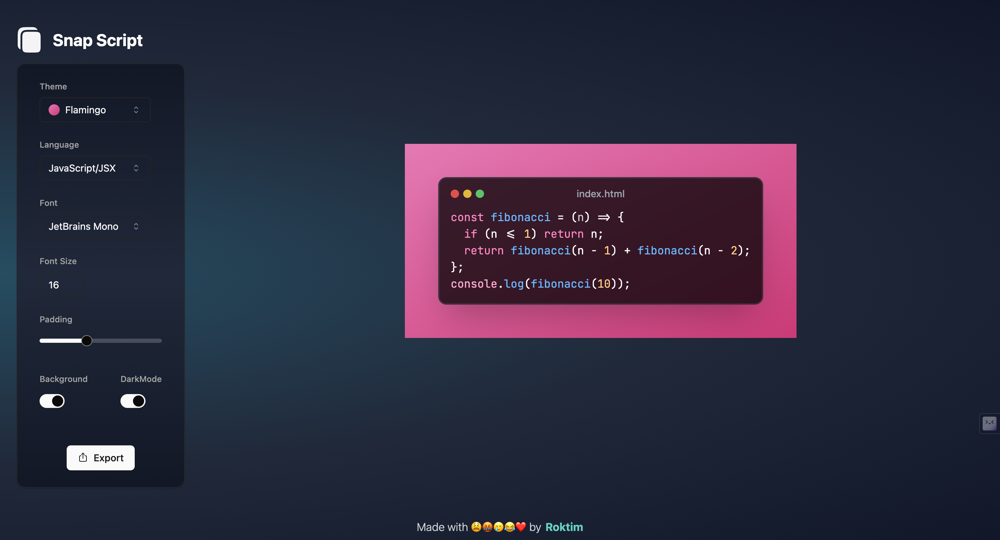

# SnapScript

SnapScript is a powerful tool for sharing code snippets. With SnapScript, you can easily share beautiful screenshots of your code on your social media platforms. Whether you're a developer looking to showcase your work or a teacher sharing code examples with your students, SnapScript has got you covered.



## Features

- **Elegant Themes**: Choose from a selection of 10+ elegant themes, including both light and dark themes, to make your code snippets stand out.

- **Font Styles**: Customize the look of your code with 12+ font styles featuring popular monospace fonts.

- **Language Support**: SnapScript supports all popular programming languages with auto-detection and syntax highlighting, ensuring your code looks its best.

- **Multiple Export Options**:

  - Save your code snippet as an SVG or PNG image.
  - Easily copy your code to the clipboard for quick sharing.
  - Generate a shareable link to your code snippet.

- **Customization**: Tailor your code snippet appearance with options like font size, padding, background color, and more.

## Technologies Used

SnapScript is built using a variety of modern technologies to provide a seamless experience:

- **React**: A powerful front-end JavaScript library that enables dynamic user interfaces.

- **Tailwind CSS**: A utility-first CSS framework that makes styling a breeze.

- **ShadCN UI**: Re-usable components built using Radix UI and Tailwind CSS for a consistent and responsive user interface.

- **Zustand**: A state management library for React that simplifies managing application state.

- **Highlight.js**: A robust syntax highlighter to make your code snippets pop.

- **React Simple Code Editor**: A browser-based code editor that allows for easy code entry and editing.

- **HTML to Image**: Generates an image from a DOM node using HTML5 canvas and SVG, perfect for creating code screenshots.

- **React Hot Toast**: Provides toast notifications for React, ensuring users receive feedback on their actions.

- **React Hotkeys Hook**: Allows for easy integration of keyboard shortcuts in components in a declarative way.

- **Resizable**: A resizable component for React to make the code snippet area just the right size.

- **Vite**: A frontend tooling system that optimizes development and builds processes for a faster development experience.

## Getting Started

To get started with SnapScript, follow these steps:

1. Clone the repository:

   ```
   git clone https://github.com/roktim32/SnapScript.git

   ```

2. Install dependencies:

   ```
   cd snapscript
   npm install
   ```

3. Start the development server:

   ```
   npm run dev
   ```

4. Open your browser and navigate to [http://localhost:3000](http://localhost:3000).

## Contributing

We welcome contributions to SnapScript! Whether it's bug fixes, new features, or improvements to the documentation, we appreciate any help from the community. Please review our [contribution guidelines](CONTRIBUTING.md) for more information.

## License

SnapScript is open-source and available under the [MIT License](LICENSE).

---

Thank you for using SnapScript! We hope it enhances your code sharing experience. If you have any questions, feedback, or issues to report, please don't hesitate to [open an issue](https://github.com/roktim32/SnapScript/issues). Happy coding!
